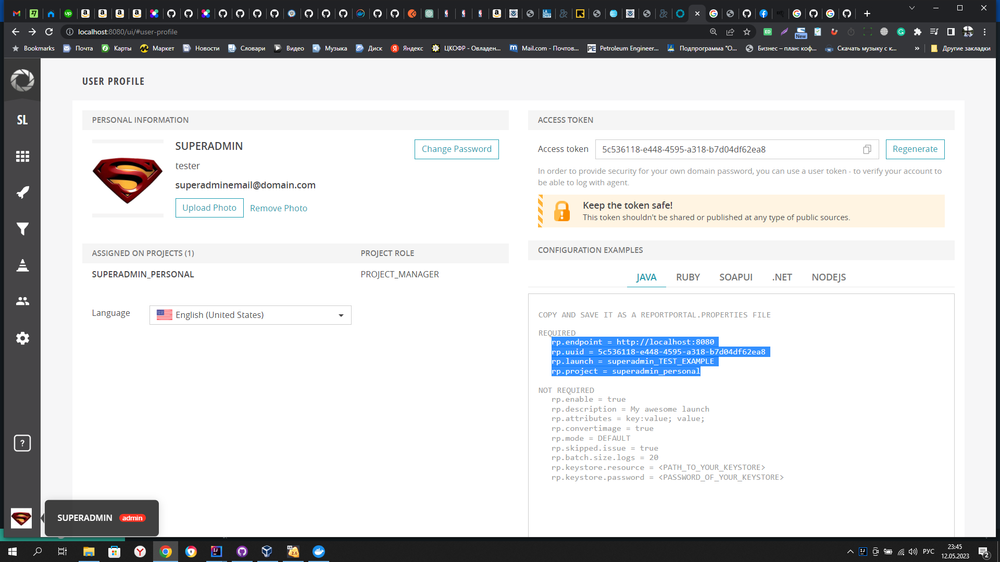

1. Установить docker на PC
2. Пройти регистрацию на сайте https://www.docker.com/
3. Авторизоваться в descop docker
4. Необходимо произвести настройку в файле [docker-compose.yml](docker-compose.yml) в случае если у вас windows читаем здесь https://reportportal.io/docs/installation-steps/DeployWithDockerOnWindows
3. В терминале в IntelijiIdea ввести команду "docker-compose -p reportportal up -d --force-recreate". Дождаться загрузки и запуска всех контейнеров.
4. Переходите на сайт http://localhost:8080/ логин для входа superadmin пароль erebus
5. Нажимаем на иконку профиля в нижнем левом углу , копируете выделенный текст и вставляете его в фойл [reportportal.properties](src%2Ftest%2Fresources%2Freportportal.properties)
5. Далее необходимо запустить файл [app-card-delivery.jar](artifacts%2Fapp-card-delivery.jar)
6. После чего запускаем тесты в идее и на сайте http://localhost:8080/ если все сделали правильно будут отображаться отчеты по тестам